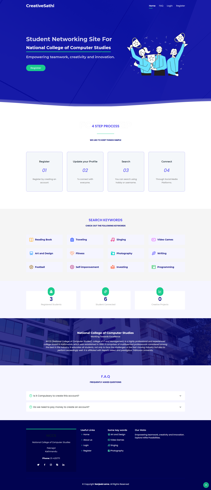
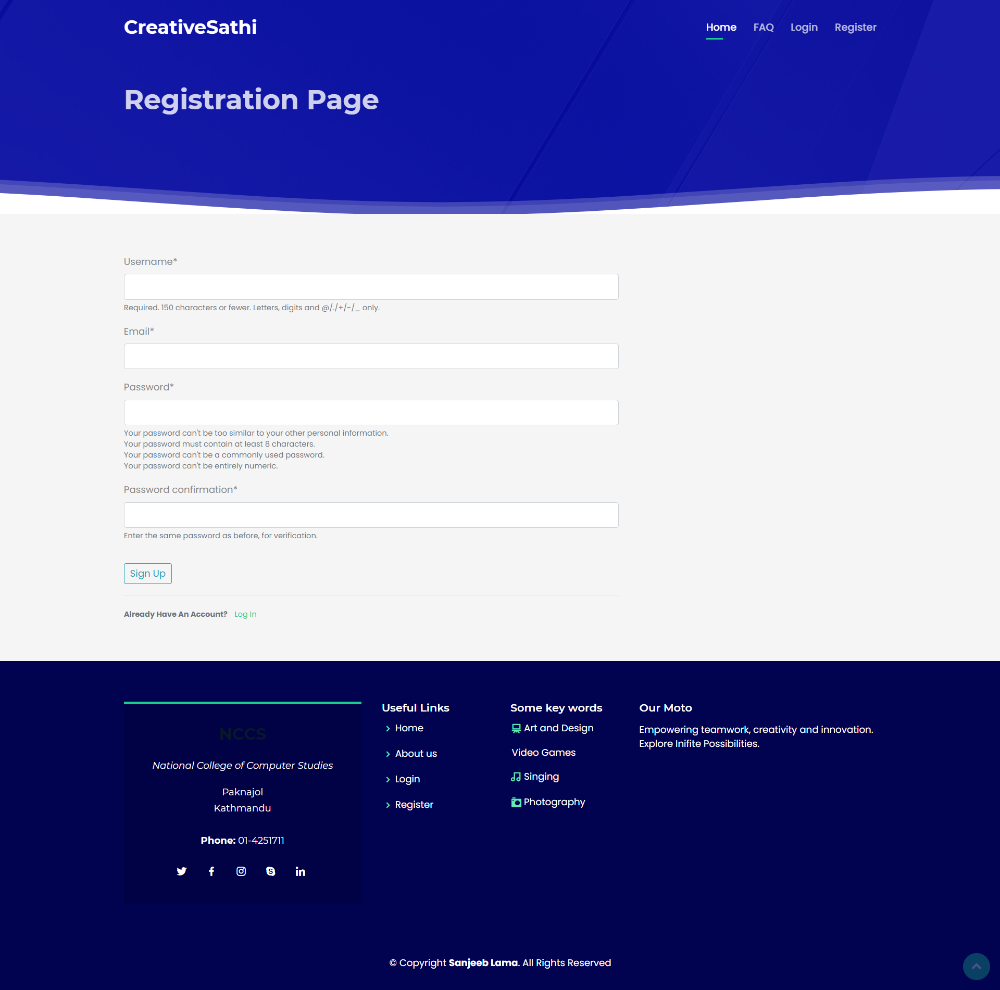
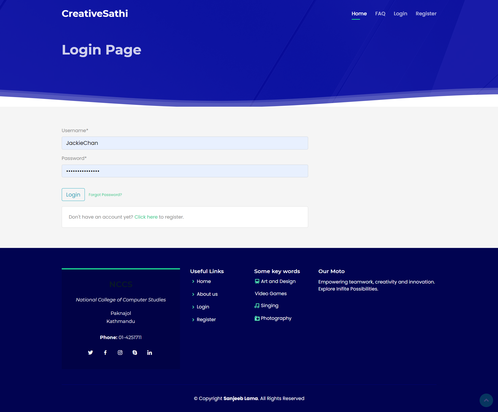
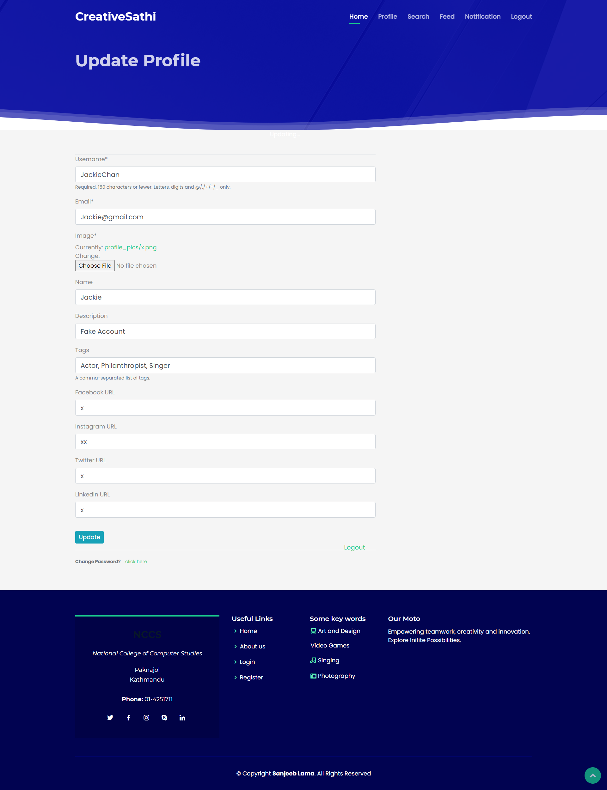
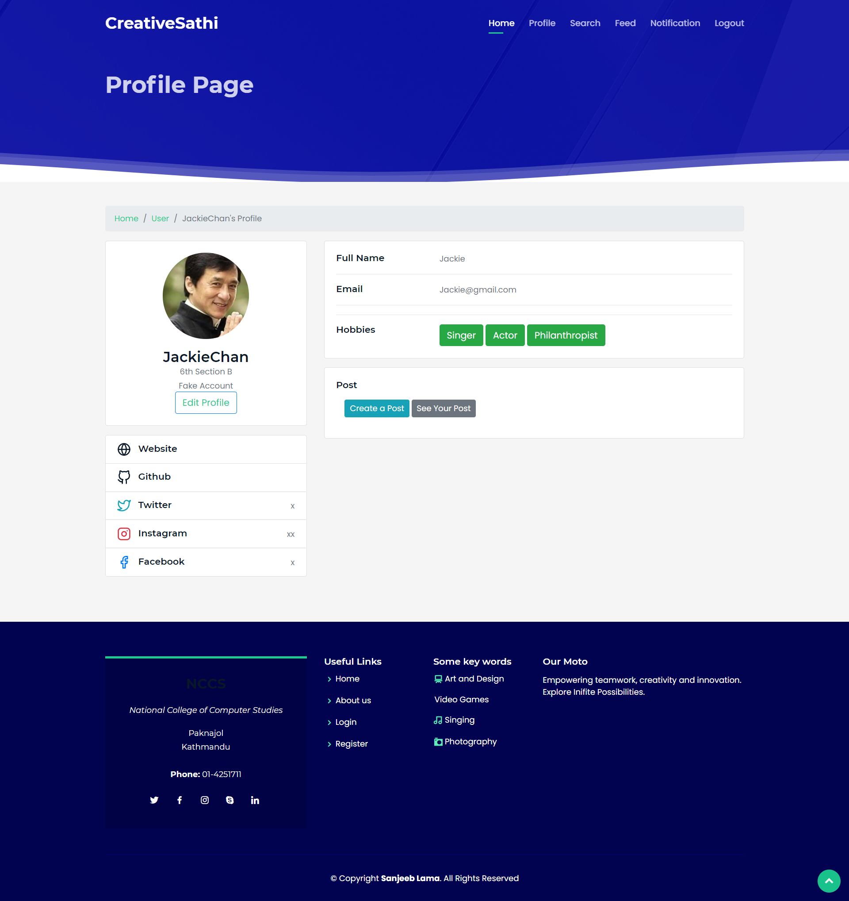
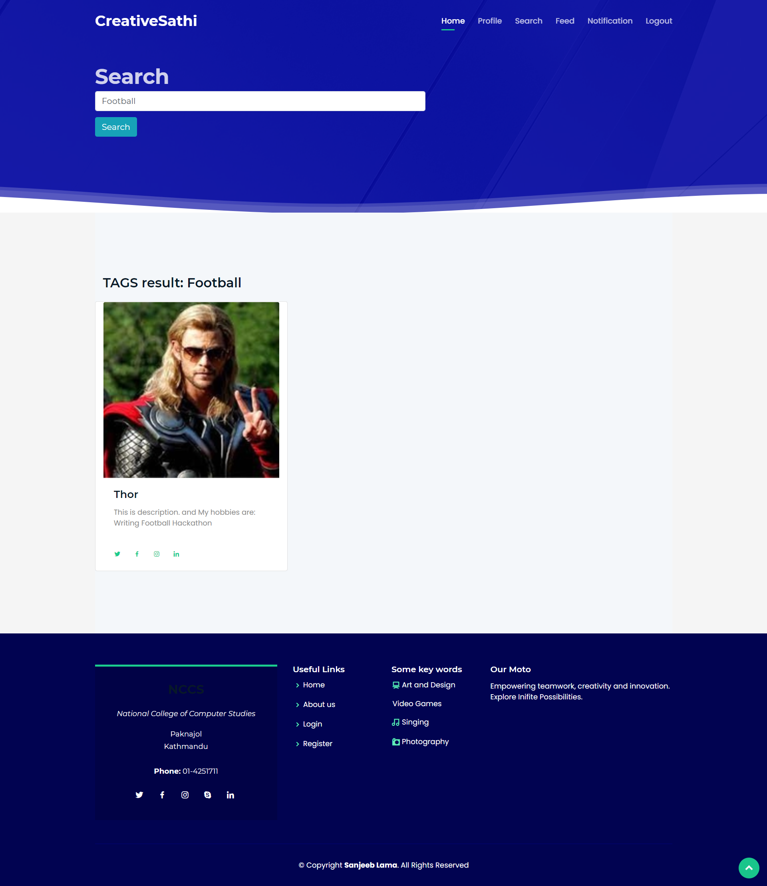
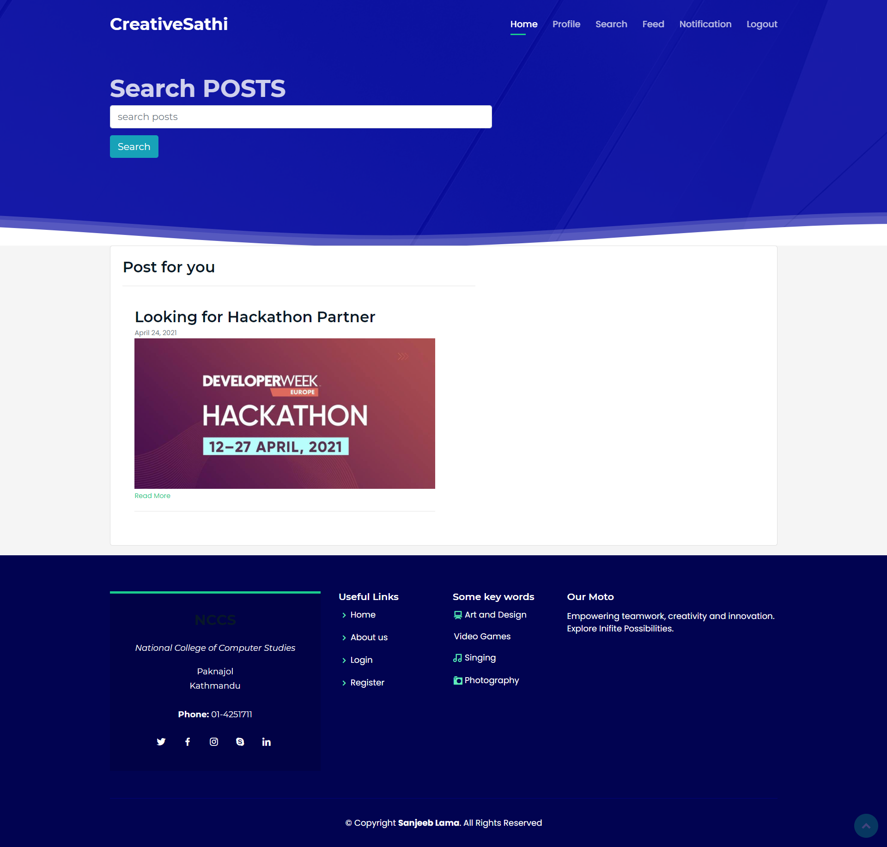

# summer_project
This is my summer project entitled “Creative Sathi” a student networking site for 
NCCS(National College of Computer Studies) college is an academic work done by “Sanjeeb Lama” submitted to the partial fulfillment of 
the requirements for the degree of Bachelor of Information Management at Faculty of Management, Tribhuvan University.

This system will help organization to overcome the absence of student club and increase student 
interaction among student of different faculty and semester with an aim to increase creative output. 
Student can register in web application and search other student who have similar hobby, interest or 
passion using username or hobby. 

# Youtube video link:
https://youtu.be/53MseCnY-b8
# Preview:
###### Index Page

###### SingUp Page

###### Login Page

###### UpdateProfile Page

###### Profile Page

###### Search Page

###### Feed Page

